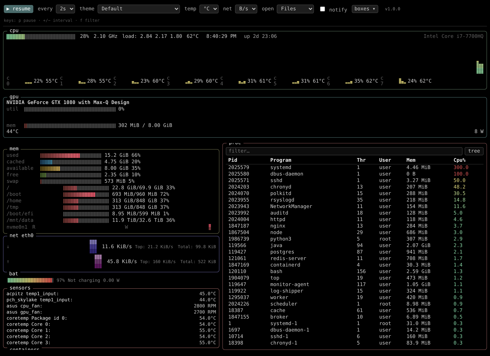
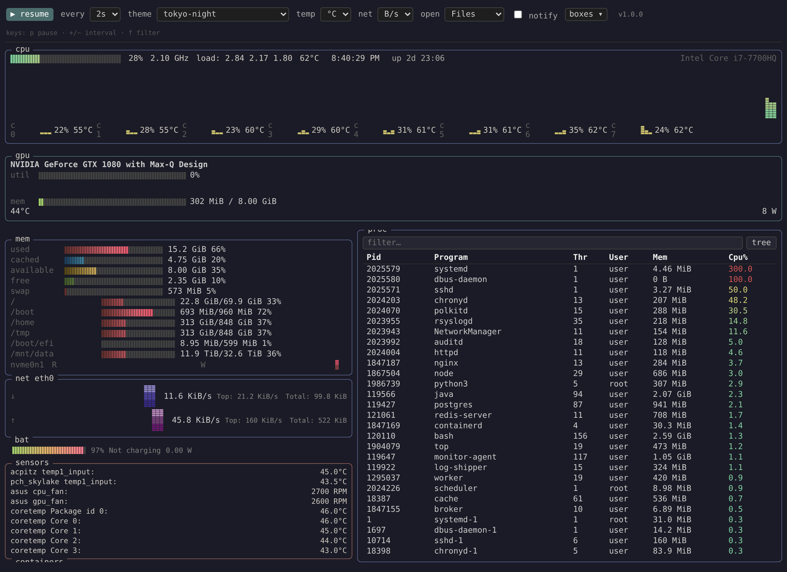
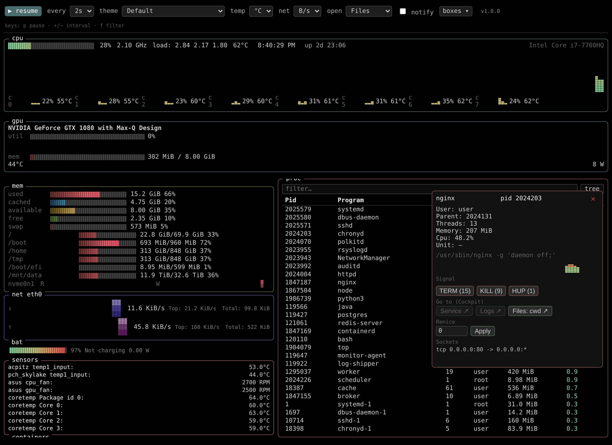

# Cockpit Top (ctop)

A **[btop](https://github.com/aristocratos/btop)-style system monitor as a native [Cockpit](https://cockpit-project.org/) plugin** — per-core CPU with braille graphs, memory/disk, network, GPU, sensors, containers, and a live, sortable process table with kill/signal, tree view, and deep-links into Cockpit. Plain ES modules + `<canvas>`, no framework, no runtime dependencies.



## More Cockpit plugins

- **[Explorer](https://github.com/ismetozalp/explorer)** — a full file manager for the Cockpit web console: browse/edit files, integrated terminal, git, and more. (Cockpit Top can deep-link a process's cwd straight into it.)
- **[IF TV](https://github.com/ismetozalp/iftv)** — turns the Cockpit web console into a full IPTV client: live TV, movies, series, an EPG guide, and host-side transcoding.

## Features

- **CPU** — per-core braille mini-graphs, per-core temps, package temp, frequency, load average, uptime, clock, and the CPU model. A full-width gradient braille graph like btop.
- **Memory** — used / cached / available / free + swap meters, per-mount usage bars, and per-disk read/write I/O graphs.
- **Network** — auto-scaling up/down braille graphs, current rate plus peak (Top) and cumulative (Total).
- **GPU** — NVIDIA util + VRAM + temperature + power (via `nvidia-smi`), hidden when absent.
- **Sensors** — every hwmon temperature and **fan RPM** beyond the CPU package.
- **Containers** — live `podman` **and `docker`** container CPU / memory / net I/O, merged into one table (an engine column appears when both are running containers).
- **Processes** — sortable table (kill / TERM / signal, **renice**), filter/search, **tree** view, a per-PID CPU sparkline, open sockets, and **deep-links** to the process's systemd **Service**, its **Logs**, and its working directory in a **file browser** — Cockpit Files or the [Explorer](https://github.com/ismetozalp/explorer) plugin, auto-detected (the button hides if neither is installed).
- **History** — back-in-time CPU history from the PCP archive (optional; enable via *boxes ▾*).
- **Themes** — loads any of btop's `.theme` files installed on the host and recolors live.
- **Toolbar** — pause, refresh interval, theme picker, °C/°F, B/s ↔ b/s, file-browser target, per-box show/hide, threshold alerts + browser notifications, and keyboard shortcuts (`p` pause, `+/−` interval, `f` filter).
- **Fits the window** — the whole plugin fills the viewport; long columns and the process list scroll *inside* their box.
- **Self-update** — one-click update from GitHub releases.

Data comes from Cockpit's built-in `metrics1` internal channel (reads `/proc` and `/sys`, no PCP required for the live view), plus a small `ps` poll for the process list.

### Themes

Pick any btop theme from the toolbar — colors, gradients, and background recolor live.



### Process detail & Cockpit deep-links

Click any process for a live CPU sparkline, open sockets, kill/signal, renice, and jump straight to its **Service**, **Logs**, or **cwd** in Cockpit.



## Install

### System-wide (recommended)

```sh
sudo make install
sudo systemctl try-restart cockpit
```

Then reload Cockpit and open **Tools → Cockpit Top**.

### Development (no root)

```sh
make devel-install     # symlink into ~/.local/share/cockpit/ctop
# edit, then reload the browser tab
make devel-uninstall
```

### Package for other machines

```sh
make zip                            # ctop-<version>.zip
rpmbuild -bb packaging/ctop.spec    # noarch RPM (cockpit-ctop)
```

## Requirements

- **cockpit-bridge ≥ 215** (for the `metrics1` channel). Nothing else is required for the core view.

Optional integrations that light up automatically when present:

| Box / feature | Needs |
|---|---|
| GPU | `nvidia-smi` |
| Containers | `podman` and/or `docker` (docker rows use the session user's socket access, else Cockpit admin privilege) |
| History | an active `pmlogger` + Cockpit's PCP support (bundled in `cockpit-bridge` on RHEL/Fedora; `cockpit-pcp` on some distros) |
| Sensors / battery | hwmon sensors under `/sys/class/hwmon`, `/sys/class/power_supply` |
| Themes | btop `.theme` files under `/usr/share/btop/themes` |

No Node.js, no build step, and no runtime dependencies are shipped to the host — the plugin is just static files.

## Self-update

Cockpit Top checks its GitHub repo for a newer release on startup (and when you click the version badge in the toolbar). When a newer version is available the badge becomes **⬆ update to vX.Y.Z**; confirming downloads the release, installs it (asks for admin), and restarts Cockpit. Configure the source repo via the `updateRepo` setting (default `ismetozalp/ctop`).

## Settings

All toolbar choices persist in `localStorage` and are re-applied on reload. Thresholds and the update repo are in the same store.

## Development & tests

```sh
npm test            # unit tests (Node built-in runner) — pure logic + module-load smoke test
make test-e2e       # thorough Playwright end-to-end (drives the real UI in Cockpit)
make test-e2e-smoke # quick e2e
```

The e2e reads Cockpit credentials from `~/.config/claude/ctop-e2e/creds` (two lines: user, password), kept outside the repo. See `test/e2e/README.md`.

## License

[Apache-2.0](LICENSE) © 2026 ismetozalp
